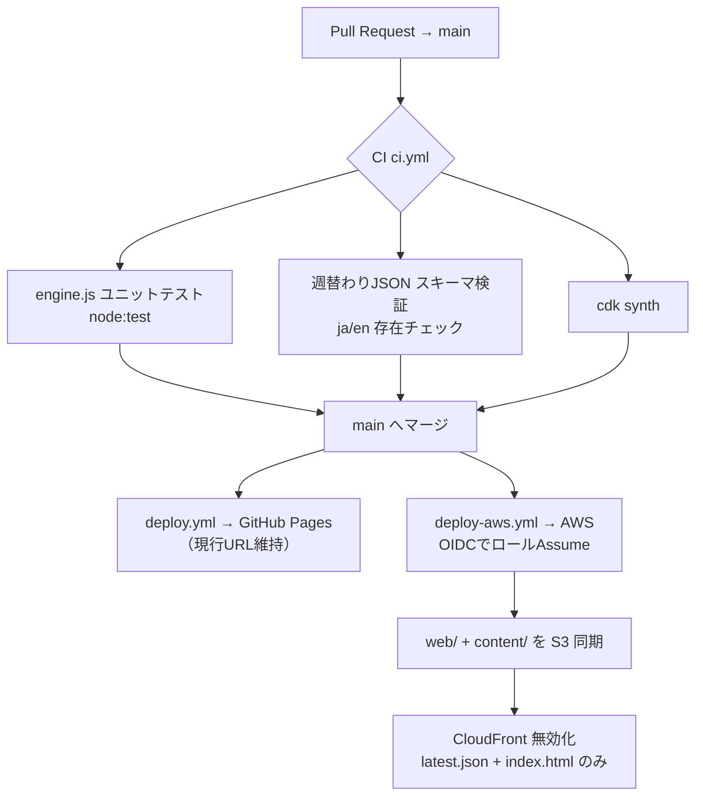

# 社会＆地域インフラ・デバッガー v6.345 (Social OS Debugger)

> 🌐 **Language / 言語:** **日本語**（このページ） ・ [**English version available →**](README.en.md)

**社会崩壊のメカニズムを、コードの言葉で理解する。**

社会を1つの巨大な分散システム（OS）に見立て、情報汚染やガバナンス崩壊が物理インフラ・個人の認知・当事者性に及ぼす**カスケード崩壊（連鎖破壊）**をリアルタイムに視覚化する、体験型教育リテラシー教材。

🔗 **[ライブデモ / Live Demo](https://larai-w.github.io/social-system-debugger/)**

🏫 **[授業で使える1枚ガイド（公共・情報I・探究 / A4印刷→PDF）](https://larai-w.github.io/social-system-debugger/classroom.html)** ／ [English classroom guide](https://larai-w.github.io/social-system-debugger/classroom.en.html)

---

## 概要 / Overview

機械学習・分散システム工学の概念（過学習、デッドロック、冗長性、Dropout、学習率、シビル攻撃）を社会現象へマッピングした**シングルファイルSPA**です。ブラウザで `index.html` を開くだけで動作し、スライダー操作に対してエージェント・シミュレーション、Chart.js、Canvasアニメーションが即座に応答します。

パラメーターを調整して4レイヤーすべてを健全域へ導くと **GRAND OPTIMAL** が認定され、Markdown形式の「デバッグ監査報告書」を出力・𝕏 (Twitter) へシェアできます。講義課題の提出物としても利用できます。

---

## 4つのレイヤー / The 4-Layer Architecture

| Layer | ページ | デバッグ対象 |
|---|---|---|
| **L1** | 情報空間 (Information Space) | エコーチェンバーによる入力データの**過学習**。フィルタリング率が上がると社会の汎化性能が失われ、メトリクスログがスローガンと排外トークンに**モード崩壊**する |
| **L2** | 物理インフラ (Regional Infrastructure) | 低倫理×Greedy戦略が引き起こす**他責デッドロック**（実務停止・救命ヘリ運休）。効率化の代償として失われる**社会的耐故障性（Redundancy Buffer）**と、ブラックスワン・ショックへの脆弱性 |
| **L3** | 個人の認知 (Cognitive Recovery) | 探索深度の浅さにつけ込む偽装ノードの**「正義の毒入れ攻撃（Poisoning Attack）」**。学習率0%でファクトを受け付けなくなる**思考凍結モード**。DROP_OUT / EARLY_STOPPING / ROOT権限制限によるリカバリー |
| **L4** | 当事者性 (Stakeholder Asymmetry) | 外部からの**シビル攻撃**・推し活化による**目的関数の乗っ取り（Objective Hijack）**。530万人の生活者（サイレントマジョリティ）の政策パケットがドロップされる構造 |

### レイヤー間のカスケード連動（緑の「⇄」バッジが目印）

- L4のゲーム化が70%を超えると、L2のインフラカードが**赤く脈動**して破壊的ストレスを警告
- L1の過学習が70%を超えると、L3の認知パラメーターカードが**紫〜赤に明滅**して認知ハックの侵食を警告
- L3の「Root権限制限」は、L2の他責デッドロックを多重承認でブロック
- L3の「反証許容度」はL2の予算配分戦略（Greedy/DP）を参照し、Greedy時は言い訳ログによる自己欺瞞を演出

---

## キラーデモ / Killer Demos

### 1. 効率至上都市へのショック注入（L2）
1. Page 2 を開き、プリセット **「⚙ 効率至上都市」** を適用
2. インフラ・財政の数値は健全に見えるが、**Redundancy Buffer が30%未満**であることを確認
3. **「⚡ 環境ショック注入」** をクリック → 即時 **SYSTEM CRASH**
4. 対比としてプリセット **「🛡 冗長性確保都市」**（Public Reboot ON）で同じショックを注入 → **SURVIVED**

> 教訓: 「無駄」に見える余白こそが、未知のショックを吸収する社会の生命線。

### 2. 脊髄反射モードでの集団リンチのデバッグ（L3）
1. Page 3 を開き、プリセット **「⚡ 脊髄反射モード」** を適用
2. 中央の偽装ノード（自称・良識派）に騙された一般ノードが、事実を述べる中立ノードへ**赤い点線の攻撃エッジ**を集中させるのを観測
3. 探索深度を **7以上** に上げる → 攻撃エッジが消滅し **DEBUGGED**
4. 応用: **「🧊 思考凍結」** プリセット（学習率0%）では、深度を上げても汚染が抜けないことを確認

> 教訓: 検証なき正義感は攻撃の燃料になる。回復には「深い探索」と「自己修正の素直さ」の両方が必要。

### 3. 見物人の殺到による政策パケットの遮断（L4）
1. Page 4 を開き、プリセット **「🎪 見物人の殺到」** を適用
2. 画面外から流入する1ビット思考のスパムノードが、生活者クラスターの通信リンクを**赤い点線で遮断**するのを観測
3. ゲーム化スコアを70%超へ → PACKET LOG の多様性が消失し、**低エントロピーなヘイトトークン**のループに
4. **「▶ EXECUTE: PACKET_FILTERING」** でシビル攻撃を遮断 → 生活者のパケット優先度が100%へ回復

> 教訓: 声の大きさではなく帯域の占拠によって、静かな多数派は物理的に消される。

---

## 主な機能 / Features

- **4ページ構成タブUI** — サイバーパンク基調の統一デザイン（各レイヤーにテーマカラー）
- **シナリオプリセット** — 全ページにワンクリックの対比実験。**危機→模範の順（赤→緑）で統一配置**（例: ワイマール崩壊、北欧型民主主義、アップデート拒否、推し活炎上）
- **判定バナー（3段階・二人称）** — 各ページの状態を **危機（赤）／注意（橙）／模範（緑）** で即時提示。「あなたの街は…」という当事者目線のコピーで、崩壊も生存も一言で伝える
- **発見ログ（収集型）** — 触るたびに新しい発見＝短い学びが集まる（全15項目）。未発見は「❓ ???」。※ストリーク・通知・緊急性の煽りは**不採用**（本アプリが批判する"ドーパミンループ設計"と矛盾しないため）
- **イントロモーダル** — 初回起動時に「社会OSの4層モデル」を図解（ℹ GUIDE でいつでも再表示）
- **(?)解説モーダル** — 全17メトリクスに日英対応の理論解説＋計算式
- **カスケード崩壊演出** — 非表示タブも裏側で監視し、レイヤー間の障害伝播をUIの明滅で警告
- **デバッグ監査報告書** — GRAND OPTIMAL達成でMarkdownレポートを生成、ワンクリックコピー＆文脈付き共有
- **共有システム** — 現在のパラメーター状態を再現URLとして共有し、LINE / 𝕏 / OS共有 / コピーへ自動フォールバック（v6.3で全レイヤーへ拡張）
- **フィードバック導線** — アプリ内フォームで改善案・バグ報告を送信（研究者・技術者向けに GitHub Issues への導線も）
- **各ページへの直接リンク** — タブ切替でアドレスバーを同期し、シナリオ状態を含まないクリーンなページURLをコピー可能
- **完全日英対応** — ENボタンで全UI・動的ステータス・ログ・報告書・**モニター見出し**まで切替
- **モバイル対応** — スマートフォン縦・横画面でのタッチ操作とログ可読性を最適化

---

## 共有システム / Share System

「結果を見せる」だけでなく、**同じ条件で再現できる実験として共有する**ための仕組みです。共有されるURLには各ページのパラメーターと表示タブが含まれるため、受け取った人は同じシナリオをそのまま開いて検証できます。

### 共有の考え方

このアプリの共有は、誰かへの断定や攻撃ではなく、**構造を一緒に観察するための実験リンク**として設計されています。共有文の末尾には「※特定の誰かではなく、どの社会にも起こる構造の話です」という注記が付き、政治的な名指しよりも、パラメーターと現象の再現性に焦点を置きます。

### 共有導線（v6.2 で導入）

- **SHARE / 共有ガイド** — ヘッダーから、共有の目的・送り方・避けたい使い方を確認できます。
- **状態別テンプレート** — 通常共有、プリセット適用後、環境ショック判定後、監査報告書作成後で、文脈に合った共有文を選べます。
- **文脈トリガー共有** — プリセット適用直後は共有トースト、判定確定直後は結果共有ボタン、GRAND OPTIMAL後は監査報告書共有ボタンが表示されます。
- **共有先フォールバック** — Web Share API が使える環境ではOS共有シートを開き、非対応環境では LINE / 𝕏 / リンクコピーへ切り替えます。
- **結果カードPNG** — 判定や監査報告書では、1200×630の結果カード画像を生成できます。対応ブラウザでは画像付き共有、非対応環境ではPNG保存にフォールバックします。

### v6.3 で追加された差分

- **全レイヤーの「判定の瞬間」共有** — これまで L2 の環境ショック判定にしかなかった「▶ この結果を送る」ボタンを、L1（安定 / 崩壊）・L3（毒入れ攻撃 / 復旧）・L4（目的関数乗っ取り / 復旧）の判定確定時にも表示。
- **ページ固有の共有文** — 各レイヤーに専用の「決め台詞」テンプレートを追加（エコーチェンバー / 毒入れ攻撃 / 目的関数乗っ取り）。汎用文への取りこぼしを解消。
- **共有作法カードの同送** — 結果カードPNGと一緒に、送り方の3か条をまとめた **⇪ 共有のつかいかた** カード（1200×630）を2枚目として添付。複数ファイル共有に非対応な環境では、結果カード1枚のみを送り、メッセージ末尾にアプリ内共有ガイドへの誘導文を自動付加。
- **作法カードの保存ボタン** — 共有ガイド内に **⬇ このカードを保存** を追加。モバイルは共有シート経由、デスクトップはPNGダウンロード。

### 技術的な変更

- `shareScenario()` を中心に、テンプレート選択 → OS共有 / LINE / 𝕏 / コピーを統合
- `buildShareURL()` を拡張し、P1だけでなく P2〜P4 の全パラメーターと表示タブをURLへ保存（旧URL `f/e/a/l` との後方互換を維持）
- `generateResultCard()` でOGP比率の結果カードPNGをCanvas生成
- v6.3: `shareP1Result()` / `shareP3Result()` / `shareP4Result()` を追加し、各レイヤーの判定確定ステートに連動
- v6.3: `generateEtiquetteCard()`（作法カード）と `shareWithEtiquette()`（2枚同送・フォールバック）を追加、生成物は初回のみキャッシュ
- OGP / Twitter Cardメタタグにより SNSカード表示へ対応
- 共有ガイド・共有ポップオーバー・共有トースト・作法カードを日英両対応

---

## 動作環境 / Requirements

- **スタンドアロン型SPA** — バンドル不要。フロント資産は `web/` 配下（Capacitor の `webDir` 兼 配信元）
- HTML5 / Canvas API / [Chart.js v4](https://www.chartjs.org/)（CDN読み込み）
- 推奨ブラウザ: Chrome / Edge / Safari / Firefox 最新版（スマートフォン対応）

```bash
git clone https://github.com/larai-w/social-system-debugger.git
cd social-system-debugger
# PWA(manifest/Service Worker)と fetch を使うため、file:// ではなく http:// で開く
npm run serve            # → http://localhost:8000 （python3 -m http.server の薄いラッパ）
# 単純にファイルを開くだけなら: open web/index.html （ただし manifest/SW は動きません）
```

> フロントは `web/index.html`（マークアップ＋起動）／`web/css/app.css`／`web/js/{i18n,engine,native,ui}.js` に分割済み。
> `engine.js` は DOM 非依存の純粋計算層（将来のサーバー側検証に再利用可能）。

---

## ネイティブアプリ / Native App（Capacitor · iOS / Android）

Web は今まで通り（GitHub Pages / AWS で配信）動きつつ、同じ `web/` を [Capacitor](https://capacitorjs.com/) でネイティブアプリ化します。ネイティブ機能はすべて `Capacitor.isNativePlatform()` でガードしており、**Web版はフル機能のまま**です。

**導入済みプラグイン**: `@capacitor/share`（共有シート）・`preferences`（`ssd_*` の耐久ミラー）・`local-notifications`（週次通知＝タスク4）・`haptics`（崩壊/巻き戻しの触覚）・`status-bar` / `splash-screen`（ダークテーマ `#070b14` 統一）。橋渡しは [`web/js/native.js`](web/js/native.js) に集約。

### ビルド手順（実機ビルドはユーザーが実施）

```bash
npm install                 # 依存取得（初回のみ）

# ネイティブプロジェクトを生成（初回のみ / ios・android は .gitignore 済み＝再生成可能）
npx cap add ios
npx cap add android

# web/ の変更を各プラットフォームへ同期（フロントを触るたびに実行）
npx cap sync

# IDE で開いて実機/シミュレータへ
npx cap open ios            # → Xcode
npx cap open android        # → Android Studio
```

### 実機ビルド前に必要な作業（チェックリスト）

- [ ] **`capacitor.config.json` の `appId`** を自分のものに変更（現在はプレースホルダ `dev.socialdebugger.app`）。App Store / Play Console のバンドルIDと一致させる
- [ ] **iOS**: Xcode（＋Command Line Tools）と [CocoaPods](https://cocoapods.org/) を導入。Xcode の *Signing & Capabilities* で自分の Apple Developer Team を選択
- [ ] **Android**: Android Studio と JDK 17 を導入。初回は Gradle 同期が走る
- [ ] **アイコン/スプラッシュ**: 現状は `#070b14` 単色。必要なら [`@capacitor/assets`](https://github.com/ionic-team/capacitor-assets) 等で生成
- [ ] **通知権限**（タスク4）: 初回シナリオのクリア直後に許可を求める設計。iOS は `Info.plist`、Android 13+ は `POST_NOTIFICATIONS` の実行時許可が必要

> `ios/` `android/` は `.gitignore` 済み。`npx cap add` でいつでも再生成できるため、リポジトリには含めません。

---

## 教育利用について / Educational Use

本アプリは情報リテラシー・社会システム論・機械学習入門の教材として設計されています。シミュレーションのパラメーターと数式は各メトリクスの (?) モーダルで公開されており、モデルの前提を批判的に検討すること自体が学習課題となります。

📄 **全計算式・しきい値・前提・限界** は [`docs/METHODOLOGY.md`](docs/METHODOLOGY.md) にまとめています（実測較正のない定性モデルである旨の免責を含む）。

---

## ドキュメント / Documentation

- [`docs/METHODOLOGY.md`](docs/METHODOLOGY.md) — 全レイヤーの計算式・しきい値・カスケード・**前提と限界**（[English](docs/METHODOLOGY.en.md)）
- [`docs/DEVELOPMENT.md`](docs/DEVELOPMENT.md) — 開発ガイド（コードの地図・変更手順・バージョン方針・デプロイ・運用注意）（[English](docs/DEVELOPMENT.en.md)）
- [`CHANGELOG.md`](CHANGELOG.md) — 変更履歴

---

## インフラ / Infrastructure (AWS)

配信基盤は **AWS CDK (TypeScript)** で IaC 定義（`/infra`）。**S3(非公開/OAC) + CloudFront** の
「静的配信＋サーバーレス」最小構成で、`web/` と `content/weekly/*.json` をホスティングします
（`latest.json` のみ 5分TTL）。構成図・選定理由・コスト根拠・セキュリティ判断・「Dockerを使わない理由」・
フェーズ2の拡張余地は **[`infra/README.md`](infra/README.md)** に記載。

```bash
cd infra && npm install && npm run synth   # 構成確認（cdk synth）
```

> GitHub Pages は現行の公開URL維持のため並行運用。AWS は本命の配信基盤／就活ポートフォリオとして構築。

---

## 計測 / Analytics（フェーズ1 KPI）

`track(event, props)` 経由で計測（現状 Plausible）。**全イベントに共通プロパティ `app_platform`（`web` / `ios` / `android`）が付く**ので、Web と ネイティブを分けて見られます。

| イベント | props | 何を意味するか |
|---|---|---|
| `weekly_start` | `id` | 週替わりシナリオへの挑戦開始 |
| `weekly_clear` | `id` | クリア（ゴール達成） |
| `weekly_fail` | `id` | 挑戦中に崩壊 |
| `share_x` / `share_line` / `card_saved` | `kind` | X / LINE / 画像保存 それぞれの共有 |
| `share_other` | `kind` | OS共有シート |
| `notification_optin` | `granted` | 週次通知の許可/拒否 |

**「20人フェーズで何を見るか」対応表**

| 見たい指標 | 近似する計測 |
|---|---|
| **週次リテンション**（戻ってくるか） | `weekly_start` のユニーク推移（週ごと・`app_platform` 別） |
| **共有の質**（説得でなく好奇心の共有か） | 共有全体に占める **`share_line` の比率**（家族・地域向けの穏やかな導線） |
| ネイティブ移行の効果 | `app_platform=ios/android` の各イベント比率 |
| 通知の効きめ | `notification_optin` 許可率 → 翌週の `weekly_start` 復帰 |

---

## CI/CD

GitHub Actions で CI/CD を構築（**長期アクセスキーを保存しない**＝AWSは OIDC 連携）。



**ワークフロー**
- `.github/workflows/ci.yml`（PR時）: engine.js ユニットテスト（`node:test`・追加依存なし）／週替わりJSONのスキーマ検証（`scripts/validate-weekly.mjs`・ja/en両方チェック）／`cdk synth`。
- `.github/workflows/deploy.yml`（main）: GitHub Pages へ（**現行の公開URLを維持**）。
- `.github/workflows/deploy-aws.yml`（main / web・content 変更時）: **OIDCでロールをAssume** → `web/`+`content/` を S3 同期 → `latest.json` と `index.html` のみ無効化。

**なぜ OIDC か**：GitHub に長期の AWS アクセスキーを置かない（漏洩リスクの排除）。ワークフロー実行ごとに STS の一時クレデンシャルを取得し、信頼ポリシーで **対象リポジトリの `main` ブランチに限定**（`repo:OWNER/REPO:ref:refs/heads/main`）。

**最小権限**（`infra/lib/social-debugger-stack.ts`）：デプロイロールは
①対象バケットの `ListBucket` ②配下オブジェクトの `Get/Put/Delete` ③対象ディストリビューションの `CreateInvalidation` のみ。
インフラ変更（`cdk deploy`）は CI ロールに含めず、管理者権限で手動実行（権限を絞るため）。

### 毎週のシナリオ更新手順（人間がやるのは「JSONを1ファイル書いてPR」だけ）

1. `content/weekly/2026-Wxx.json` を1つ追加（`content/weekly.schema.json` に準拠）
2. `content/weekly/latest.json` を今週分に差し替え
3. PR を出す → **CIがスキーマ検証**（ja/en欠けなどを自動で弾く）
4. main にマージ → **`deploy-aws.yml` が S3 反映＋`latest.json` 無効化**まで自動

> Docker は使いません（静的配信＋サーバーレスで常駐プロセスが無いため）。理由の詳細は [`infra/README.md`](infra/README.md)。

---

*Engine: Markov Chain + Monte Carlo + Agent-Based Simulation | © 2026 Social OS Debugger — Educational Tool*
