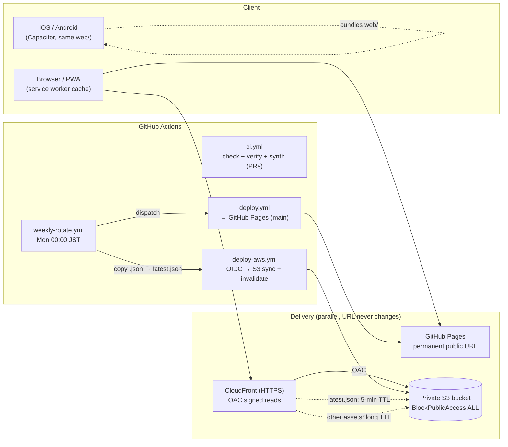
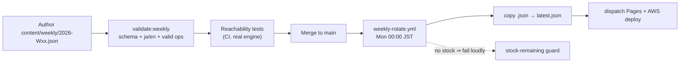

# Architecture

> A 15-minute technical tour for engineers and hiring reviewers. For the day-to-day
> developer guide see [`DEVELOPMENT.en.md`](DEVELOPMENT.en.md); for the AWS stack in
> depth see [`../infra/README.md`](../infra/README.md); for release history see
> [`../CHANGELOG.md`](../CHANGELOG.md). The delivery history is also readable as a
> GitHub Issues portfolio (see [`github-project.md`](github-project.md)).

**Social OS Debugger** is a buildless vanilla-JS educational simulator that lets you
watch how a society cascades into collapse as you move sliders. This document is the
technical counterpart to that product: it explains *how the system is built and
operated*, and *why* each decision was made. It is deliberately biased toward the
trade-offs a cloud/infrastructure reviewer cares about — delivery, security posture,
CI/CD, cost, and how quality is enforced without a heavy toolchain.

---

## 1. System overview

The product is a single set of static assets under `web/` (classic `<script>` tags,
no bundler) that ships to two delivery planes in parallel, plus a small pipeline of
GitHub Actions that build, verify, deploy, and rotate weekly content. The same `web/`
directory is also the Capacitor `webDir`, so the exact assets that serve on the web
also compile into the iOS/Android apps.

The only runtime external dependency is **Chart.js v4** from a CDN; agent
visualizations are drawn on raw Canvas. If Chart.js is blocked, the app degrades
gracefully (sliders, tabs, sharing keep working) — a property that is asserted in CI,
not just hoped for (see §4).

---

## 2. Key design decisions

### No bundler — classic scripts sharing global scope
The front-end was split from a single `index.html` into `web/js/{i18n, engine, native,
share, scenario, ui}.js` (plus `demo.js`), loaded as plain classic `<script>` tags in
a **meaningful order** (`i18n → engine → native → share → scenario → ui → demo`). They
are *not* ES modules, so inline `onclick="fn()"` handlers keep resolving against the
shared global scope. The split was mechanical: concatenating the files reproduces the
original byte-for-byte, which is why the module boundary introduced **zero behavioral
regression**. No build step means no toolchain to break, no source maps to chase, and
the served asset is the authored asset.

### DOM/window-free `engine.js`
All pure calculation and model state (`metrics()`, `simTimeline()`, `clamp/lerp/seedRng`,
`HIST_REF/PRESETS/MDATA`) lives in `engine.js` and touches no `document` or `window`.
This lets the same code run under Node for unit tests (`tests/engine.test.mjs` loads
the source as a `Function` and returns the exports) and for content-reachability checks,
and it leaves the door open to reuse the exact goal-evaluation logic for server-side
validation in a future phase — without dragging the DOM along.

### Dual delivery — GitHub Pages *and* CloudFront
GitHub Pages gives a permanent, zero-cost public URL that never changes. AWS
S3+CloudFront was **added** (not swapped in) to demonstrate a production cloud delivery
path for the portfolio. Both serve the same `web/` tree; the public Pages URL is
treated as immutable so links in slides, READMEs, and store listings never rot.

### Private S3 + CloudFront OAC
The S3 bucket is `BlockPublicAccess.BLOCK_ALL` and is **never** public. The only way to
reach an object is through CloudFront using **Origin Access Control (OAC)** — the
recommended successor to OAI — with the bucket policy scoped by CDK to allow only that
distribution. HTTPS is enforced on both sides (S3 `enforceSSL` + CloudFront
`REDIRECT_TO_HTTPS`), and objects are encrypted at rest (SSE-S3). A direct S3 request
returns `403`, which is the confirmation that OAC is doing its job.

### Only `latest.json` gets a short TTL
Weekly content flows through one "latest" pointer, `content/weekly/latest.json`. That
single object is served on a **5-minute** cache policy so a rotation propagates quickly;
every other static asset gets a long TTL (with a path open to `immutable` under future
filename-hash versioning). This keeps the cache aggressive where it's safe and fresh
only where it must be.

### Network-first service worker
`web/sw.js` is intentionally **network-first** for same-origin JS/CSS so a fresh deploy
is not shadowed by a stale cached bundle; the cache is the offline fallback, not the
source of truth. The `CACHE` version string is bumped on every change to the core file
list — a deliberate, visible knob rather than an implicit hash.

### Keyless deploy via GitHub OIDC (least privilege, `main`-only)
CI/CD to AWS assumes a role via **GitHub OIDC** — there are **no long-lived AWS keys**
stored anywhere. The trust policy is scoped to `main` only, and the role's permissions
are minimal: S3 List/Get/Put/Delete plus CloudFront `CreateInvalidation`. Crucially
`cdk deploy` is *excluded* from that role — the pipeline can ship assets but cannot
mutate infrastructure. Invalidation is limited to `latest.json` and `index.html`
(never a wasteful `/*`).

### Why there is no Docker
The stack is static delivery + serverless: there is **no long-running process** to
containerize. Adding Docker would only add image management, patching, and standing
cost for no running workload to justify it. Containers (e.g. Fargate) would only earn
their keep once a persistent process exists — a WebSocket fan-out or a heavy background
job — which the current scope does not have. Even the planned Phase-2 features (a shared
"towns saved" counter, weekly guardian signatures) fit API Gateway + Lambda + DynamoDB,
so containers stay unnecessary.

---

## 3. Content pipeline (weekly scenarios)

New scenarios are authored as JSON, not code. The human step each week is literally
"add one JSON file and open a PR"; everything downstream is automated and guarded.

1. **Schema + validation.** Each scenario declares its win condition *declaratively*
   as `goalConds: [{ metric, op, value }, …]` (AND-combined), validated against
   `content/weekly/weekly.schema.json` by `scripts/validate-weekly.mjs`
   (`npm run validate:weekly`). Missing `ja`/`en` copy or a bad operator is rejected.

2. **Reachability CI — the interesting part.** Two test files run the *real* logic to
   prove a scenario is beatable *before* it ships:
   - `tests/weekly-reachability.test.mjs` loads `engine.js` and does a grid search over
     PAGE 1's parameter space to assert the goal is (a) reachable and (b) **not already
     satisfied at the starting parameters** (an "instant-clear" bug).
   - `tests/weekly-reachability-p234.test.mjs` (added in T40) can't use the pure engine
     for PAGE 2–4 because those metrics live inside `ui.js`'s dynamic simulation, so it
     **extracts the relevant `ui.js` function bodies from source** (brace-balanced) and
     executes them headless to check the same two properties, and asserts the P3/P4
     formula strings still exist in source so a silent formula rename trips the test.

   This isn't theoretical: the reachability guard has caught **three real content
   bugs** — two at T20 (a shipped JSON and the bundled fallback were already at their
   goal at start = instant clear; fixed to a "recover from a degraded state" design)
   and one at T40 on the PAGE 2–4 path.

3. **Automatic Monday rotation.** `weekly-rotate.yml` runs every Monday 00:00 JST,
   computes the ISO week, copies `content/weekly/<week>.json` onto `latest.json`,
   bot-commits it, and (because a `GITHUB_TOKEN` push won't chain-trigger other
   workflows) explicitly dispatches the Pages and AWS deploys via `gh workflow run`.

4. **Stock-remaining guard.** A week with no matching JSON makes the rotation **fail
   loudly** — that failure *is* the "write more scenarios" reminder, so running out of
   content is impossible to ignore.

At runtime the app fetches `latest.json` on startup (origin configured by
`CONTENT_BASE_URL` / `web/config.js`) and falls back to the bundled copy if the fetch
fails. All of this is gated behind `WEEKLY_ENABLED` (native), so the web build is a
no-op here.

---

## 4. Quality gates

Quality is enforced by machine at three moments — pre-commit, PR, and merge — all
running the *same* command, so "green locally" and "green in CI" cannot diverge.

- **Console-zero Playwright harness.** `scripts/verify.mjs` (run by `npm run verify` /
  `make verify`, and as the CI `verify` job) replays the project's manual checklist —
  load the app, switch all four tabs, apply a preset, move a slider, inject the P2
  shock, exercise P3/P4, generate an export — and asserts **zero Console errors and
  zero pageerrors**. It runs this across **two cases: Chart.js loaded and Chart.js CDN
  blocked**, which is how graceful degradation is proven rather than assumed.
- **Unit + guardrail tests** (`node:test`, no extra deps): `engine.test.mjs` (pure
  math/metrics), `scenario-goals.test.mjs`, `share-url.test.mjs`, the two reachability
  suites above, and `invariants.test.mjs` — a repo-specific "how this codebase breaks"
  guard that, for example, asserts every inline `on*="fn()"` handler in the markup
  resolves to a function defined somewhere in the JS (a regression that recurred during
  the module split).
- **`npm run check` = the single source of truth.** It runs the tests + weekly JSON
  validation + eslint + prettier. eslint is configured for a no-bundler, global-scope
  codebase (`no-undef`/`no-unused-vars` disabled — function resolution is covered by
  `invariants.test.mjs` instead) so it only flags genuine bug-shaped rules; prettier is
  scoped to code/data/config and deliberately **excludes** the dense hand-written
  front-end to avoid noisy, regression-prone reformatting.
- **Offline-start verification.** The PWA can be installed from the ≡ menu (a
  `beforeinstallprompt` native prompt on supported browsers, a per-OS instructions modal
  for iOS Safari and friends). `scripts/verify:offline` (`npm run verify:offline`) backs
  the "works offline" claim with a test: a dependency-free tiny static server serves
  `web/`, the service worker registers, the browser goes offline, and a reload must still
  start from the SW cache, close the intro, navigate tabs, and log **zero console /
  pageerror**.
- **Advisory Lighthouse audit.** `.github/workflows/lighthouse.yml` runs weekly (and on
  demand) against the live Pages URL to track PWA / performance / accessibility scores.
  It is **advisory only** — it never fails CI — and stores reports as artifacts.
- **Full-history secret scan.** `.github/workflows/secret-scan.yml` runs **gitleaks**
  over the entire git history (`fetch-depth: 0`) on every push and PR, making the one-off
  manual secret audit a permanent, automated gate.
- **Content-Security-Policy.** With Chart.js self-hosted there are zero external script
  origins, so the page ships a CSP meta (`script-src 'self'` plus inline handlers) that
  structurally blocks third-party script injection; the offline and browser verifications
  run against the policy on every change.
- **Pre-commit == CI.** A pre-commit hook (`make hooks`) runs `npm run check` before a
  commit lands, and the CI `web` job runs the identical `npm ci` + `npm run check`, so
  a lint/format drift cannot reach `main`.
- **Branch protection.** `make protect` requires PRs with the web/infra CI checks
  passing before merge (CodeQL is advisory, not required).

---

## 5. AI-assisted delivery with human governance

Much of the sprint work (T1–T54) was produced with an explicit delegation protocol,
and it's worth being precise about the division of labor because the governance — not
the automation — is the point.

- The **main session** (a higher-capability model) owns the parts that carry
  cross-file risk: writing the task spec (`docs/task-spec-template.md`), reviewing the
  diff, **re-running the acceptance commands itself**, and doing the commit.
- Self-contained tasks (new standalone files under `docs/`, `content/`, `scripts/`,
  `promo/`; translations; data) are delegated to an **Opus sub-agent**. Sub-agents are
  **forbidden from committing or pushing**; they deliver a diff and a verification trace.
- Two hard-won rules are baked into the protocol: the parent **never trusts a
  sub-agent's self-reported "green"** and always re-runs `npm run check` / `make verify`
  (a sandboxed agent may not even be able to run them); and if `Write` is denied in the
  sandbox, the agent delivers the design plus a verification trace and the parent
  transcribes it.
- This is reflected in the public record: delegated tasks carry the
  **`process:ai-subagent`** label in the GitHub Issues portfolio, so a reviewer can see
  exactly which work was delegated and that it went through spec → review → parent
  re-verification → commit. No claim here is stronger than what the CHANGELOG, tests,
  and Issues actually show.

---

## 6. Cost & operations

- **Cost: within the free tier.** For the target scale (initial ~20 users to a few
  thousand page-views/month) the AWS side is expected to stay essentially free. S3 holds
  a few MB of static assets (well inside the free tier); CloudFront's perpetual free
  tier (1 TB egress + 10M requests/month) dwarfs the actual traffic; invalidations are
  capped at `latest.json` + `index.html` (the first 1,000 paths/month are free). GitHub
  Pages and Actions minutes for a repo this size are likewise free. CloudFront uses
  `PriceClass 200` (Asia/NA/EU edges) rather than the global class to trim cost further.
- **Operations are automated to the point of "add one file."** Weekly content rotates
  itself (`weekly-rotate.yml`) and fails loudly when stock runs out; deploys are
  event-driven (`deploy-aws.yml` only fires on `web/`/`content/` changes and skips
  entirely until the AWS variables are set, so it's neutral, not red, before wiring);
  and session hygiene is scripted — a Stop hook warns on iCloud conflict copies /
  uncommitted / unpushed work, and `make handoff` gates the end of a session on a clean,
  hand-off-able state. `make help` is the single operational entry point.

---

*Applies to: Phase 1 (module split, Capacitor, weekly scenarios, AWS delivery, CI/CD)
complete, plus strategy/delegation sprints T1–T54. Sources: repository files only — no
figures invented; no real people, places, or ongoing politics named.*
