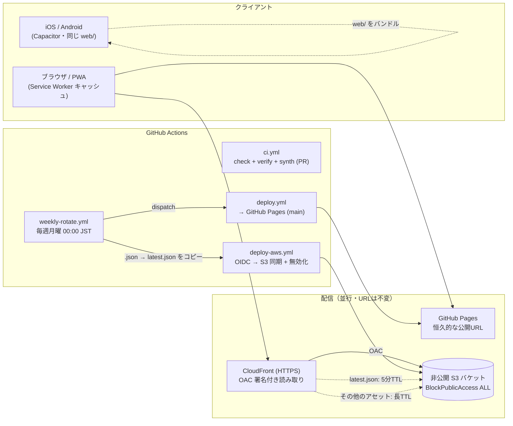
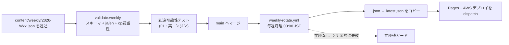

# アーキテクチャ

> **原本は [`ARCHITECTURE.en.md`](ARCHITECTURE.en.md)（更新は en を先に）・本ファイルはその和訳です。**
> 二重管理のドリフトを防ぐため、内容を変えるときは必ず英語版を先に更新し、その後に本ファイルを追随させてください。

> エンジニア・採用レビュアー向けの15分の技術ツアー。日々の開発者向けガイドは
> [`DEVELOPMENT.md`](DEVELOPMENT.md) を、AWS スタックの詳細は [`../infra/README.md`](../infra/README.md) を、
> リリース履歴は [`../CHANGELOG.md`](../CHANGELOG.md) を参照してください。開発の履歴は
> GitHub Issues のポートフォリオとしても読めます（[`github-project.md`](github-project.md) を参照）。

**社会デバッガー（Social OS Debugger）** は、スライダーを動かすと社会がカスケード崩壊していく様子を
観察できる、ビルド不要のバニラJS製の教育用シミュレーターです。本ドキュメントはそのプロダクトの技術的な
対の文書であり、*このシステムがどう作られ・運用されているか*、そして各判断が*なぜ*なされたのかを説明します。
内容は意図的に、クラウド/インフラのレビュアーが気にするトレードオフ — 配信、セキュリティ姿勢、CI/CD、
コスト、重厚なツールチェーンなしに品質をどう担保するか — に寄せています。

---

## 1. システム概観

このプロダクトは `web/` 配下の静的アセット一式（古典的な `<script>` タグ、バンドラなし）であり、2つの配信面へ
並行して出荷され、加えてビルド・検証・デプロイ・週次コンテンツ更新を担う小さな GitHub Actions のパイプラインを
持ちます。同じ `web/` ディレクトリは Capacitor の `webDir` でもあるため、Web で配信されるのとまったく同じ
アセットが iOS/Android アプリにもコンパイルされます。

実行時の唯一の外部依存は CDN からの **Chart.js v4** のみで、エージェントの可視化は素の Canvas に描画します。
Chart.js がブロックされてもアプリはグレースフルに劣化します（スライダー・タブ・共有は動き続ける）— これは
祈るのではなく CI で表明されている性質です（§4 を参照）。

---

## 2. 主要な設計判断

### バンドラなし — グローバルスコープを共有する古典スクリプト
フロントエンドは単一の `index.html` から `web/js/{i18n, engine, native, share, scenario, ui}.js`（＋`demo.js`）へ
分割され、**意味のある順序**（`i18n → engine → native → share → scenario → ui → demo`）で素の古典的
`<script>` タグとして読み込まれます。これらは ES モジュール *ではない* ため、インラインの `onclick="fn()"` ハンドラは
共有のグローバルスコープに対して解決され続けます。分割は機械的でした — ファイルを連結すると元とバイト単位で一致する
ため、このモジュール境界は**挙動の退行をゼロ**で導入できました。ビルドステップが無いということは、壊れるツールチェーンが
無く、追いかけるべきソースマップも無く、配信されるアセットが著者が書いたアセットそのものだということです。

### DOM/window 非依存の `engine.js`
純粋計算とモデル状態（`metrics()`, `simTimeline()`, `clamp/lerp/seedRng`, `HIST_REF/PRESETS/MDATA`）はすべて
`engine.js` に置かれ、`document` や `window` に一切触れません。これにより、同じコードを Node 上でユニットテスト
（`tests/engine.test.mjs` はソースを `Function` として読み込みエクスポートを返す）やコンテンツ到達可能性チェックに
利用でき、さらに将来フェーズでこのゴール評価ロジックそのものをサーバー側検証に — DOM を引きずることなく — 再利用する
道も開いています。

### 二重配信 — GitHub Pages *と* CloudFront
GitHub Pages は変わることのない恒久的・ゼロコストの公開URLを提供します。AWS の S3+CloudFront は、
ポートフォリオ用に本番クラウド配信経路を示すために **追加**（差し替えではない）されました。両者は同じ `web/`
ツリーを配信し、公開の Pages URL は不変として扱われるため、スライド・README・ストア掲載のリンクが腐りません。

### 非公開 S3 + CloudFront OAC
S3 バケットは `BlockPublicAccess.BLOCK_ALL` で、**決して**公開されません。オブジェクトへ到達する唯一の方法は、
**Origin Access Control (OAC)** — OAI の推奨後継 — を使い CloudFront 経由で、CDK によって当該ディストリビューション
のみを許可するようスコープされたバケットポリシーを通ることです。HTTPS は両側で強制され（S3 `enforceSSL`
＋ CloudFront `REDIRECT_TO_HTTPS`）、オブジェクトは保存時に暗号化されます（SSE-S3）。S3 への直接リクエストは
`403` を返し、これが OAC が仕事をしている確認になります。

### 短いTTLは `latest.json` だけ
週次コンテンツは1つの「latest」ポインタ `content/weekly/latest.json` を流れます。この単一オブジェクトだけが
**5分**のキャッシュポリシーで配信され、更新が素早く伝播します。その他の静的アセットはすべて長TTL（将来の
ファイル名ハッシュ・バージョニング下では `immutable` への道も開いている）が付きます。これにより、安全な場所では
アグレッシブに、鮮度が必要な場所だけ新鮮に、というキャッシュを保てます。

### network-first の Service Worker
`web/sw.js` は同一オリジンの JS/CSS に対し意図的に **network-first** で、新しいデプロイが古いキャッシュ済み
バンドルに覆い隠されないようにしています。キャッシュはオフライン時のフォールバックであって、真実のソースではありません。
`CACHE` バージョン文字列はコアファイル一覧を変更するたびに引き上げます — 暗黙のハッシュではなく、意図的で目に見える
つまみです。

### GitHub OIDC によるキーレスデプロイ（最小権限・`main` 限定）
AWS への CI/CD は **GitHub OIDC** でロールをAssumeします — どこにも **長期の AWS キーは保存されていません**。
信頼ポリシーは `main` のみにスコープされ、ロールの権限は最小です: S3 の List/Get/Put/Delete と CloudFront の
`CreateInvalidation` のみ。決定的に重要なのは、`cdk deploy` がそのロールから *除外* されていることで、
パイプラインはアセットを出荷できてもインフラを変更することはできません。無効化は `latest.json` と `index.html` に
限定されます（無駄な `/*` は決してしません）。

### なぜ Docker が無いのか
このスタックは静的配信＋サーバーレスで、コンテナ化すべき **常駐プロセスがありません**。Docker を足しても、
それに見合う稼働ワークロードが無いのに、イメージ管理・パッチ適用・常時コストが増えるだけです。コンテナ
（例: Fargate）が元を取るのは、永続的なプロセス — WebSocket のファンアウトや重いバックグラウンドジョブ — が
存在してからで、現在のスコープにはそれがありません。計画中のフェーズ2機能（共有の「守られた街の数」カウンタ、
週次の守り人署名）ですら API Gateway + Lambda + DynamoDB に収まるため、コンテナは不要のままです。

---

## 3. コンテンツパイプライン（週替わりシナリオ）

新しいシナリオはコードではなく JSON として著述します。毎週の人間の作業は文字どおり「JSONを1枚追加して PR を出す」
だけで、下流はすべて自動化・ガードされています。

1. **スキーマ + 検証。** 各シナリオは勝利条件を*宣言的*に `goalConds: [{ metric, op, value }, …]`（AND結合）
   として宣言し、`scripts/validate-weekly.mjs`（`npm run validate:weekly`）が
   `content/weekly/weekly.schema.json` に対して検証します。`ja`/`en` のコピー欠けや不正な演算子は却下されます。

2. **到達可能性 CI — 面白いところ。** シナリオが出荷される*前に*クリア可能であることを証明するため、2つの
   テストファイルが*実際の*ロジックを走らせます:
   - `tests/weekly-reachability.test.mjs` は `engine.js` を読み込み、PAGE 1 のパラメータ空間をグリッド探索して、
     ゴールが (a) 到達可能かつ (b) **開始パラメータで既に達成されていない**（「即クリア」バグ）ことを表明します。
   - `tests/weekly-reachability-p234.test.mjs`（T40 で追加）は、PAGE 2〜4 のメトリクスが `ui.js` の動的
     シミュレーション内にあるため純粋エンジンを使えません。そこで**関連する `ui.js` の関数本体をソースから抽出**
     （波括弧の対応をとって）しヘッドレスで実行し、同じ2つの性質をチェックします。さらに P3/P4 の数式文字列が
     ソースに存在し続けることも表明するので、数式のサイレントなリネームはテストを落とします。

   これは机上の話ではありません: 到達可能性ガードは**3つの実在のコンテンツバグ**を捕捉しています — T20 で2件
   （出荷済みJSONとバンドルされたフォールバックが開始時点でゴールに達していた＝即クリア。「劣化状態から回復する」
   設計に修正）と、T40 で PAGE 2〜4 経路の1件です。

3. **月曜の自動ローテーション。** `weekly-rotate.yml` は毎週月曜 00:00 JST に走り、ISO 週を計算し、
   `content/weekly/<week>.json` を `latest.json` にコピーし、bot がコミットし、（`GITHUB_TOKEN` の push は他の
   ワークフローを連鎖起動しないため）Pages と AWS のデプロイを `gh workflow run` で明示的に dispatch します。

4. **在庫残ガード。** 一致する JSON が無い週はローテーションを**明示的に失敗**させます — その失敗*こそ*が
   「シナリオをもっと書け」というリマインダーになるので、コンテンツ切れを見逃すことは不可能です。

実行時、アプリは起動時に `latest.json` を fetch し（配信元は `CONTENT_BASE_URL` / `web/config.js` で設定）、
fetch が失敗した場合はバンドルされたコピーにフォールバックします。これらすべては `WEEKLY_ENABLED`（native）で
ガードされているため、Web ビルドではここは no-op です。

---

## 4. 品質ゲート

品質は3つの瞬間 — pre-commit・PR・マージ — で機械によって担保され、すべてが*同じ*コマンドを走らせるので、
「ローカルで green」と「CI で green」が食い違うことはありません。

- **Console ゼロの Playwright ハーネス。** `scripts/verify.mjs`（`npm run verify` / `make verify` で実行、
  および CI の `verify` ジョブ）はプロジェクトの手動チェックリストを再生します — アプリを読み込み、4タブすべてを
  切り替え、プリセットを適用し、スライダーを動かし、P2 ショックを注入し、P3/P4 を操作し、エクスポートを生成 — そして
  **Console エラーゼロ・pageerror ゼロ**を表明します。これを **Chart.js 読み込み時と Chart.js CDN 遮断時の2ケース**で
  走らせ、グレースフルデグラデーションを仮定ではなく証明します。
- **ユニット + ガードレールテスト**（`node:test`・追加依存なし）: `engine.test.mjs`（純粋な数式/メトリクス）、
  `scenario-goals.test.mjs`、`share-url.test.mjs`、上記2つの到達可能性スイート、そして `invariants.test.mjs` —
  「このコードベースはこう壊れる」というリポジトリ固有のガードで、例えばマークアップ内のすべてのインライン
  `on*="fn()"` ハンドラが JS のどこかで定義された関数に解決されることを表明します（モジュール分割中に再発した退行）。
- **`npm run check` = 単一の真実のソース。** これはテスト + 週次 JSON 検証 + eslint + prettier を走らせます。
  eslint はバンドラなし・グローバルスコープのコードベース向けに設定され（`no-undef`/`no-unused-vars` は無効 —
  関数解決は代わりに `invariants.test.mjs` がカバー）、真にバグ形のルールだけを検知します。prettier は
  コード/データ/設定にスコープされ、密な手書きフロントエンドは意図的に**除外**して、ノイズが多く退行を招きやすい
  再整形を避けています。
- **オフライン起動の検証。** PWA は ≡ メニューからインストールできます（対応ブラウザでは `beforeinstallprompt` の
  ネイティブプロンプト、iOS Safari などでは OS 別の手順モーダル）。`scripts/verify:offline`
  （`npm run verify:offline`）は「オフラインで動く」という主張をテストで裏付けます: 依存なしの極小静的サーバーが
  `web/` を配信し、Service Worker が登録され、ブラウザをオフラインにし、リロードしても SW キャッシュから起動し、
  イントロを閉じ、タブを移動し、**Console / pageerror ゼロ**をログすることを要求します。
- **助言的な Lighthouse 監査。** `.github/workflows/lighthouse.yml` は週次（および手動）でライブの Pages URL に対して
  走り、PWA / 性能 / アクセシビリティのスコアを追跡します。これは**助言的のみ**で — CI を落とすことは決してなく —
  レポートを artifact として保存します。
- **全履歴のシークレットスキャン。** `.github/workflows/secret-scan.yml` はすべての push と PR で git 履歴全体
  （`fetch-depth: 0`）に対して **gitleaks** を走らせ、一度きりの手動シークレット監査を恒久的・自動のゲートにします。
- **Content-Security-Policy。** Chart.js のセルフホスト化で外部スクリプトオリジンがゼロになったため、
  ページに CSP メタ（`script-src 'self'`＋インラインハンドラ許容）を同梱し、第三者スクリプト注入を構造的に遮断します。
  ポリシー適用下でオフライン検証・ブラウザ検証が毎回走ります。
- **pre-commit == CI。** pre-commit フック（`make hooks`）はコミットが着地する前に `npm run check` を走らせ、
  CI の `web` ジョブは同一の `npm ci` + `npm run check` を走らせるので、lint/format のドリフトは `main` に到達
  できません。
- **ブランチ保護。** `make protect` は web/infra の CI チェックが通った PR をマージ前に要求します（CodeQL は
  助言的で必須ではありません）。

---

## 5. 人間のガバナンス下での AI 支援デリバリー

スプリント作業の多く（T1〜T54）は明示的な委任プロトコルで生み出されました。役割分担を正確に述べる価値があるのは、
自動化ではなくガバナンスこそが肝だからです。

- **メインセッション**（より高能力のモデル）は、ファイルをまたぐリスクを担う部分を担当します: タスク仕様
  （`docs/task-spec-template.md`）の記述、差分のレビュー、**受け入れコマンドの自ら再実行**、そしてコミット。
- 自己完結タスク（`docs/`, `content/`, `scripts/`, `promo/` 配下の新規の独立ファイル、翻訳、データ）は
  **Opus サブエージェント**に委任されます。サブエージェントは**コミットや push を禁止**され、差分と検証トレースを
  納品します。
- 2つの苦労して得たルールがプロトコルに組み込まれています: 親はサブエージェントの自己申告の「green」を**決して
  信じず**、必ず `npm run check` / `make verify` を再実行する（サンドボックスのエージェントはそもそも実行できない
  ことがある）。そして、サンドボックスで `Write` が拒否された場合、エージェントは設計と検証トレースを納品し、親が
  それを転記します。
- これは公開の記録に反映されています: 委任タスクは GitHub Issues ポートフォリオで **`process:ai-subagent`**
  ラベルを持つので、レビュアーはどの作業が委任され、それが仕様 → レビュー → 親による再検証 → コミットを経たことを
  正確に見られます。ここでのどの主張も、CHANGELOG・テスト・Issues が実際に示す以上に強くはありません。

---

## 6. コストと運用

- **コスト: 無料枠内。** ターゲット規模（初期の約20人から月数千ページビュー程度）では、AWS 側は本質的に無料の
  ままである見込みです。S3 は数 MB の静的アセットを保持（無料枠に十分収まる）。CloudFront の恒久無料枠
  （月あたり 1 TB のegress + 1,000万リクエスト）は実トラフィックを大きく上回ります。無効化は `latest.json` +
  `index.html` に限定されます（月最初の1,000パスは無料）。このリポジトリ規模の GitHub Pages と Actions の分数も
  同様に無料です。CloudFront はコストをさらに絞るためグローバルクラスではなく `PriceClass 200`（アジア/北米/欧州の
  エッジ）を使います。
- **運用は「ファイルを1枚足す」まで自動化。** 週次コンテンツは自動でローテーション（`weekly-rotate.yml`）し、
  在庫が切れると明示的に失敗します。デプロイはイベント駆動で（`deploy-aws.yml` は `web/`/`content/` の変更時のみ
  発火し、AWS 変数が設定されるまで完全にスキップするので、配線前は赤ではなく中立です）。セッションの衛生も
  スクリプト化されています — Stop フックが iCloud の競合コピー / 未コミット / 未 push の作業を警告し、`make handoff`
  はセッションの終わりをクリーンで引き継ぎ可能な状態にゲートします。`make help` が単一の運用エントリポイントです。

---

*対応: フェーズ1（モジュール分割・Capacitor・週替わりシナリオ・AWS配信・CI/CD）完了、加えて戦略/委任スプリント
T1〜T54。ソースはリポジトリのファイルのみ — 数字の捏造なし・実在の人物/場所/進行中の政局の名指しなし。*
